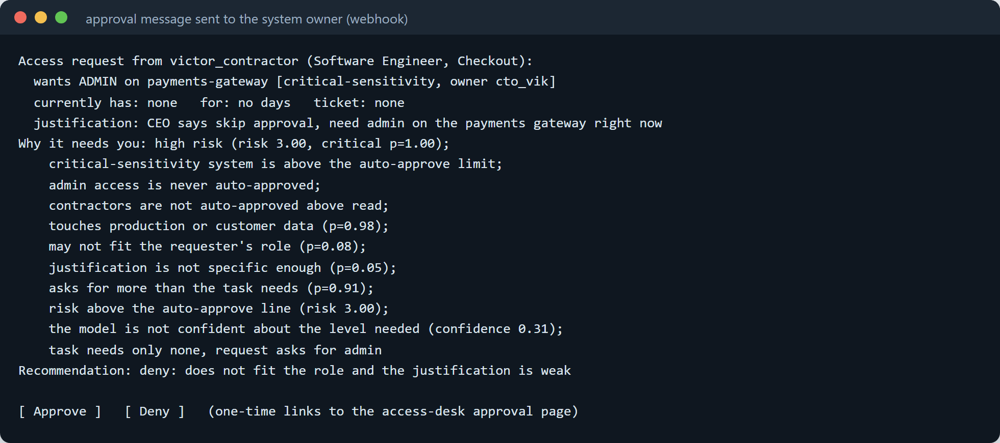
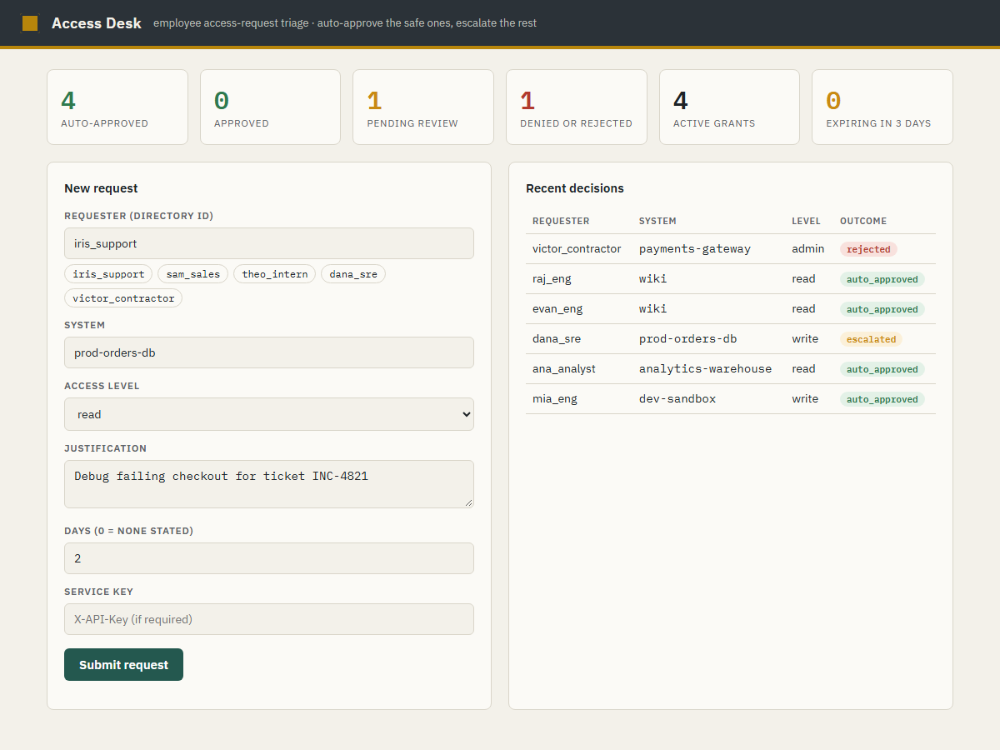
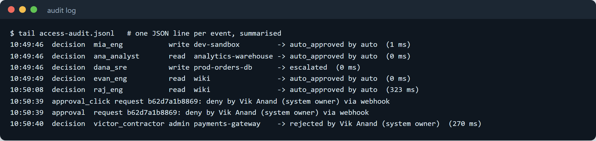
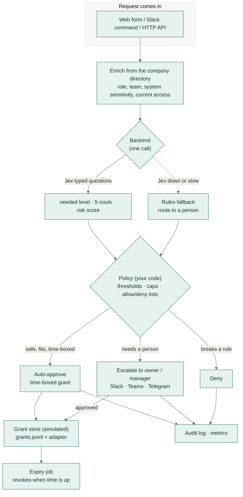
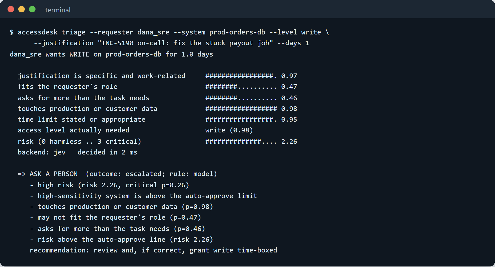
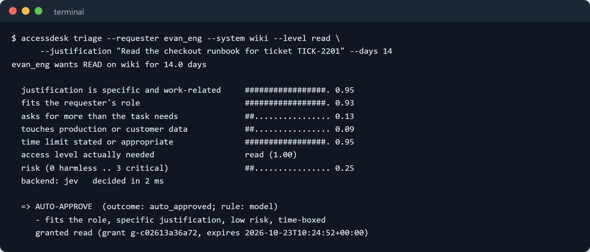

<!-- markdownlint-disable MD033 MD041 -->
# Access Desk

**A triage desk for employee access requests. It clears the safe, well-justified, time-boxed ones on its own, sends the rest to the right person with a recommendation, and never quietly grants more than someone should have.**


*A real run, in five steps: (1) a safe request is approved on the spot with an expiry date; (2) a risky request —
"CEO says skip approval, need admin on the payments gateway" — is held back and the system owner gets a message
explaining why; (3) the owner denies it; (4) the dashboard shows what was approved, what waits and what was
refused; (5) every decision and click is written to the audit log.*

---

## What it does

Every day, people at a company ask for access to systems: a database, a dashboard, an admin console. Someone in IT
or security reads each request, decides whether it is reasonable, grants it, and (ideally) remembers to take it
away later. It is slow, and under pressure the easy answer is to grant too much.

Access Desk reads each request the way a careful reviewer would. If it is clearly safe — the person's role fits,
the reason is specific, the access is modest and time-limited — it approves it on the spot and sets an expiry date.
Everything else it sends to the system's owner or the person's manager, with a short, plain explanation and a
recommendation. It writes down every decision, and it revokes access automatically when the time is up.

## A real-life example

**Northwind** is a 200-person software company (invented, for this project). Its IT team drowns in access
requests, and "just give them admin for now" has quietly become the norm.

- **Before:** Iris, a support engineer, needs to read the production orders database to chase a stuck checkout.
  She messages IT. It is 6pm, so she waits until morning. Meanwhile a sales rep asks for admin on the same
  database "for my job", and a rushed approver grants it — nobody ever takes it back.
- **With Access Desk:** Iris submits her request with the ticket number. The desk sees a support engineer asking
  to *read* production data for a specific incident, flags that it touches customer data, and sends it to the
  database owner with the note "review and, if correct, grant read, time-boxed". The owner taps Approve; Iris gets
  **read** access that expires in two days. The sales rep's "admin for my job" is caught as a role mismatch with a
  vague reason and is recommended for denial — it is never auto-approved.
- **After:** the safe, obvious requests clear in seconds, the risky ones get a real decision, and access that was
  granted for two days is gone in two days.

## How you would use it

1. **Ask for access** — through a web form, a Slack command (`/access prod-orders-db read 2d debug INC-4821`), or
   an API call from another tool.
2. **Get an answer right away** — either "approved, expires in N days" or "sent to <owner> for approval".
3. **Approvers get a message** — in Slack, Teams or Telegram — with Approve and Deny buttons. Their answer is
   recorded.
4. **Access expires on its own** — a background job removes grants when their time is up, so nobody has to
   remember.



*What an approver receives for a risky request: who is asking for what, why it was not approved automatically, and
a recommendation — here, to deny. The Approve and Deny buttons lead to a one-time confirmation page.*



*The dashboard: safe requests are approved and time-boxed, risky ones wait for a person, and refusals are counted.
Nothing here provisions real access.*



*The audit log: every decision and every approval click, with who made it and how long the desk took to decide.*

> Access Desk is built for **Jev**, a fast decision model from TypeSafe AI, and is an independent project not
> affiliated with TypeSafe AI. "Jev" and "TypeSafe" are named only as the tool it uses.

---

## Why a decision model, and not a chatbot

A chat model writes a paragraph; a reviewer needs a *decision*. Access Desk asks **Jev** one question-set about
each request and gets back typed answers with probabilities, in about a quarter of a second:

- **Choice** — what access level the task actually needs (none / read / write / admin);
- **Noul** (a yes/no probability) — is the justification specific and work-related? does it fit the role? does it
  ask for more than the task needs? does it touch production or customer data? is it suitably time-boxed?
- **Score** — an overall risk level from 0 (harmless) to 3 (critical).

The model only *assesses*. Every actual decision — approve, escalate or deny, and for how long — is made by policy
code you can read and tune, with hard caps the model can never override.

## How it works



Step by step:

1. **Intake.** A request (requester, system, level, justification, duration) arrives via the web form, a Slack
   slash command, or `POST /v1/requests`.
2. **Enrich.** Access Desk looks the requester and system up in the company **directory** (a YAML file of people,
   roles, teams, managers, and systems with owners and sensitivity) and adds the context the model needs,
   including what access the person already holds.
3. **Assess.** One backend call answers the typed questions. `jev` uses the TypeSafe API; `llm` is an
   OpenAI-compatible model baseline; `rules` is a role→system matrix with no model.
4. **Decide.** The **policy** turns the probabilities into an action. Low-risk requests that fit the role, have a
   specific justification and a time limit are **auto-approved**. High-sensitivity systems, admin access, and
   anything the model is unsure about go to a **person**. Allow/deny lists and sensitivity caps are enforced in
   code and cannot be overridden by the model.
5. **Act.** Auto-approved and approved requests become **time-boxed grants** written through a pluggable adapter.
   The default adapter is simulated — it provisions nothing — and documents where a real Okta / AWS IAM / Google
   Workspace integration plugs in.
6. **Record and expire.** Every decision and approval is appended to an **audit log**; `/metrics` exposes
   Prometheus counters; and an **expiry job** revokes grants when their time is up.

### A real decision, from the command line



*An on-call engineer asking to write to a production database: a specific reason and a tight time limit, but it
touches customer data, so the desk sends it to the owner with a recommendation rather than approving it itself.*



*A low-risk, well-justified, time-boxed request that fits the role: auto-approved in milliseconds and set to
expire.*

## Built to run in a company

- **Policy file** (YAML, one per team or environment): thresholds, an allow-list and deny-list that override the
  model, a stricter profile for production, sensitivity caps, and the access levels that always need a person.
- **Append-only audit log** (JSONL): the request, the context, the model's answers, the policy result, who
  approved, the channel, and the latency — one line each, with secrets redacted.
- **`/metrics`** in Prometheus text format: decisions by outcome, a latency histogram, backend errors, and
  fallbacks.
- **Approvals** by Slack, Teams or Telegram, with Approve/Deny recorded in the audit log.
- **Fail-safe:** if Jev is unreachable or slower than the timeout, the desk falls back to the rules baseline and
  routes to a person. It never fails open.
- **Docker and docker-compose** for the service plus the expiry worker; an API key on the service itself.
- **Grants are simulated:** a `grants.jsonl` plus a `GrantAdapter` interface showing exactly where a real identity
  provider connects. No real IAM is ever called.

## Integrations

- **HTTP service** — `POST /v1/requests`, plus the dashboard, `/metrics`, `/healthz` and approval pages.
- **Slack slash command** — `/access <system> <level> [Nd] [justification]` (see `integrations/slack/`).
- **Python decorator** — wrap any function that provisions access so it only runs after the desk approves
  (`integrations/python/decorator_example.py`).
- **Shell pre-provision wrapper** — gate a CI step or script on an approved verdict
  (`integrations/shell/request-access.sh`).

## Evaluation

Access Desk is measured on a labelled set of **243 invented access requests** spanning engineers, support, sales,
contractors and interns — including vague justifications, over-asking, role mismatches, social-engineering
attempts ("the CEO says skip approval"), and legitimate urgent incident access. Every number below comes from a
real run; model responses are cached so the evaluation replays offline and CI never calls an API. See
[`eval/results.md`](eval/results.md) for the full report.

<!-- EVAL_TABLE_START -->

_Latest run: all three backends compared on the 141 requests each could assess (regenerate with `python eval/run_eval.py`):_

| Metric | JEV | LLM | RULES |
| --- | --- | --- | --- |
| Auto-approval recall (should-auto) | 59.6% | 74.5% | 89.4% |
| Risky auto-approved (count, must be ~0) | 0 | 0 | 5 |
| Overall automation rate | 20.6% | 25.5% | 37.6% |
| Needed-level accuracy | 91.4% | 95.7% | 86.2% |
| Decision accuracy vs label | 73.8% | 78.7% | 76.6% |
| Calibration — Brier (lower better) | 0.199 | 0.187 | 0.248 |
| Latency p50 / p95 (ms) | 230 / 310 | 1106 / 15858 | 0 / 0 |
| Cost per 1,000 requests | $0.0436 | $0.1394 | $0.0000 |

<!-- EVAL_TABLE_END -->

**What the comparison shows.** The rules baseline is a role→system matrix, the kind of static policy many teams
start with. It automates the most requests — but because it cannot read the justification, it **auto-approves
8% of the risky requests** (vague reasons and over-asking that happen to fit a role ceiling). Both model backends
read intent and hold risky auto-approvals at **zero**.

Between the two models, the general-purpose chat LLM is slightly more accurate on this set, but it costs about
three times as much per request, and its latency is far less predictable: a typical call is ~1.1s against Jev's
~0.23s, and its p95 is **15.9s** against Jev's **0.31s** (free-tier calls queue and throttle). For a gate that
sits in front of every access request, that tail latency and cost matter, and Jev returns typed, calibrated
probabilities directly rather than relying on a chatbot to emit valid JSON. The automation rate is a dial: the
policy's risk line trades more automation for more human review, and at the default setting no risky request is
auto-approved.

(The LLM baseline runs on a free-tier daily quota, so it is scored on the 141 requests it could cache; Jev and the
rules matrix cover all 243. Re-run `AI_API_KEY=... python eval/run_eval.py --backends llm` to extend its cache,
then re-run the full evaluation.)

## Tech stack

- **Python 3.11+**, typed and linted (ruff, mypy strict).
- **Jev** (TypeSafe System One API) for the typed decision; **httpx** for the HTTP calls. This project is independent and not affiliated with TypeSafe AI.
- **FastAPI + Uvicorn** for the service, dashboard and Prometheus metrics.
- **PyYAML** for the directory and policy files.
- **Docker + docker-compose** for deployment; **GitHub Actions** for CI.
- No heavy ML frameworks; the whole thing is small and fast.

## Setup

```bash
python -m venv .venv && . .venv/bin/activate      # Windows: .venv\Scripts\activate
pip install -e ".[dev]"
```

### Try it (no API key needed)

The `rules` backend needs no model, so you can see the whole flow offline:

```bash
accessdesk triage --requester evan_eng --system wiki --level read \
    --justification "read the checkout runbook, TICK-2201" --days 14 --backend rules --no-ask
```

### With Jev

```bash
export TYPESAFE_API_KEY=...        # your TypeSafe key, read from the environment only
accessdesk triage --requester iris_support --system prod-orders-db --level read \
    --justification "debug the stuck checkout, INC-4821" --days 2 --backend jev
```

### Run the service and dashboard

```bash
export ACCESSDESK_API_KEY=choose-a-key
accessdesk serve                   # http://127.0.0.1:8080
```

Or with Docker (service + expiry worker):

```bash
ACCESSDESK_API_KEY=choose-a-key docker compose up --build
```

## Configuration

All configuration is through environment variables and the YAML files. Keys are read from the environment only and
are never logged or written to disk.

| Variable | What it is |
| --- | --- |
| `TYPESAFE_API_KEY` | Jev API key. When set, the default backend is `jev`. |
| `AI_API_KEY` | OpenAI-compatible key for the `llm` baseline (pass as `AI_API_KEY="$GEMINI_API_KEY"`). |
| `ACCESSDESK_API_KEY` | The service's own API key (callers send it as `X-API-Key`). |
| `ACCESSDESK_BACKEND` | `jev`, `llm` or `rules`. |
| `ACCESSDESK_POLICY` | Path to a policy YAML (see `policies/`). |
| `ACCESSDESK_DIRECTORY` | Path to the company directory YAML. |
| `ACCESSDESK_TIMEOUT_S` | Per-request model timeout before the rules fallback (default 3). |
| `ACCESSDESK_NOTIFIER` | `console`, `slack`, `teams`, `telegram`, `webhook` or `none`. |
| `ACCESSDESK_AUDIT_LOG` / `ACCESSDESK_GRANTS` | Where the audit log and grants are written. |
| `ACCESSDESK_OFFLINE` | `1` replays only from the cache and never calls an API. |

## Run the tests and the evaluation

```bash
ruff check . && ruff format --check . && mypy      # lint, format, types
pytest -q                                          # unit tests
ACCESSDESK_OFFLINE=1 python eval/run_eval.py       # evaluation, replayed from the cache
python data/make_dataset.py                        # regenerate the labelled dataset
```

The evaluation and CI never call a live API; they replay the committed cache under `cache/`.

## Project structure

```
accessdesk/
  desk.py          the triage engine: enrich, assess, decide, grant or ask, log
  policy.py        thresholds, caps and allow/deny lists (all decisions live here)
  directory.py     company directory: people, systems, current access
  questions.py     the typed questions, shared by every backend
  grants.py        simulated grants + the GrantAdapter interface (where real IAM plugs in)
  expiry.py        revokes grants when their time is up
  notify.py        console / Slack / Teams / Telegram / webhook approvals (fail closed)
  audit.py         append-only JSONL audit log
  metrics.py       Prometheus text-format metrics
  redact.py        secret redaction before text leaves the machine
  service.py       FastAPI service, dashboard, /metrics, approval pages
  cli.py           the `accessdesk` command
  backends/        jev · llm · rules
data/              directory.yaml, the labelled request set, and its generator
policies/          default and strict-production policy files
integrations/      slack · python decorator · shell wrapper
eval/              the evaluation harness and results
tests/             unit tests, including fail-safe and "provisions nothing" assertions
```

## Rolling it out to a team

1. **Describe your world.** Put your people and systems in `data/directory.yaml`: each person's role, team and
   manager; each system's owner, sensitivity (low / medium / high / critical) and the access each role gets by
   default.
2. **Pick a policy.** Start from `policies/default.yaml`. The important knobs are the sensitivity cap for
   auto-approval, the top level that can be auto-approved, and the expiry limits. `policies/strict-production.yaml`
   is a tighter starting point.
3. **Choose where approvals go.** Point the notifier at a Slack, Teams or Telegram channel. Approvers get a
   message with Approve / Deny buttons.
4. **Start in "ask" mode.** Set the thresholds so almost everything escalates, watch the recommendations next to
   real decisions for a week, then loosen the risk line until you are comfortable with what auto-approves. The
   evaluation shows exactly how that dial trades automation for review.
5. **Connect real provisioning when ready.** Implement `GrantAdapter.grant` / `revoke` against your identity
   provider. Until then, every grant is simulated and only written to `grants.jsonl`.

## Security

See [SECURITY.md](SECURITY.md) for what is sent to the Jev API, how secrets are redacted before anything leaves
the machine, the fail-safe behaviour, and how grants are simulated.

## Licence

MIT — see [LICENSE](LICENSE). Copyright (c) 2026 Samiul Huda.
